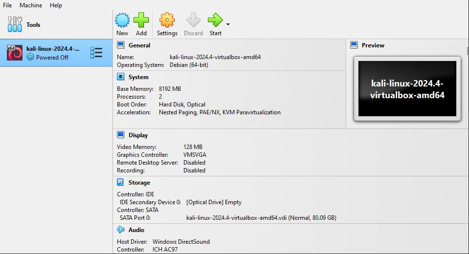
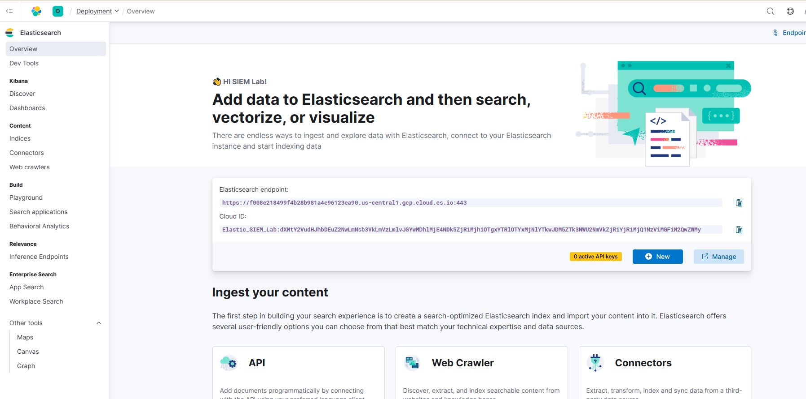
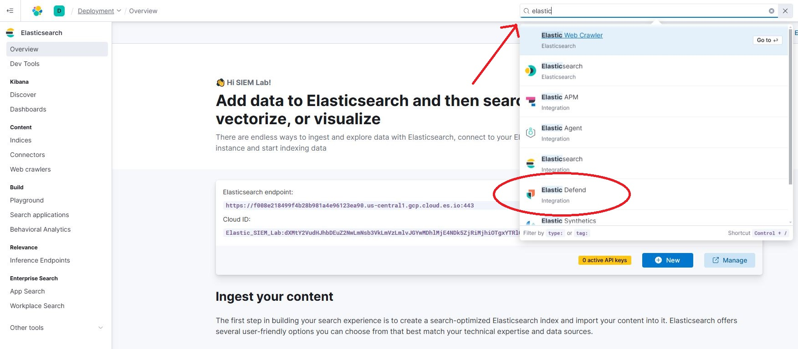
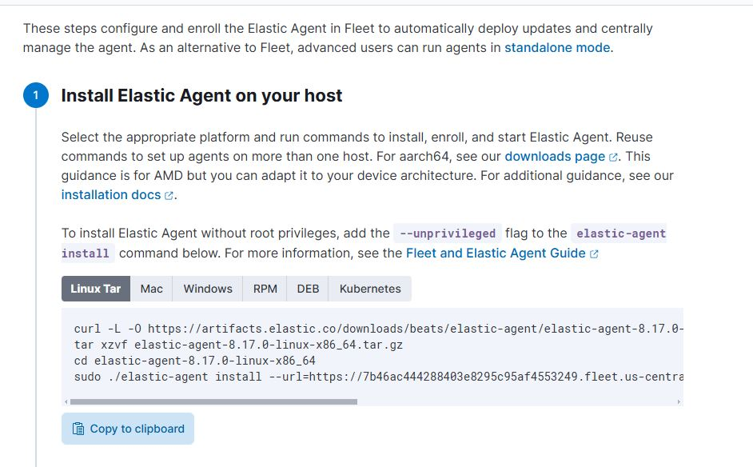
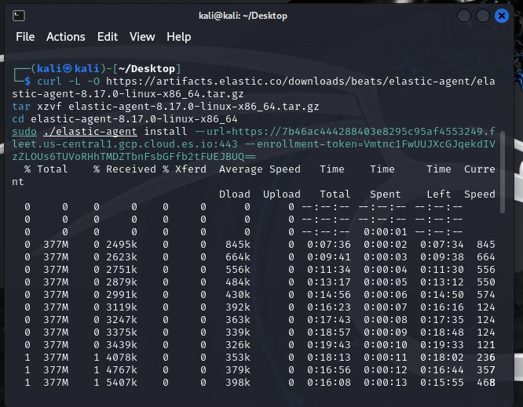
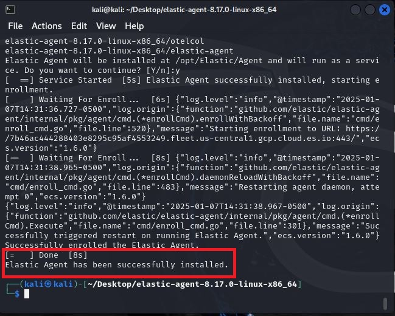
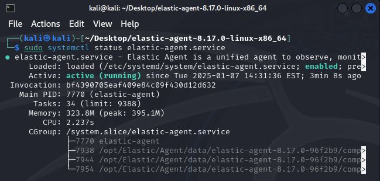
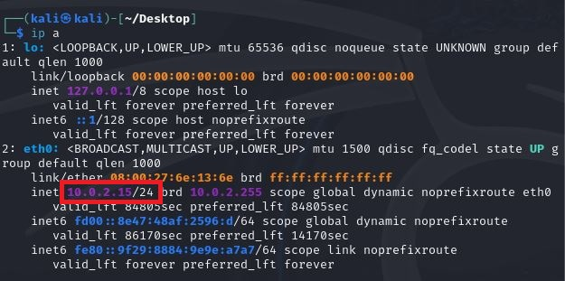
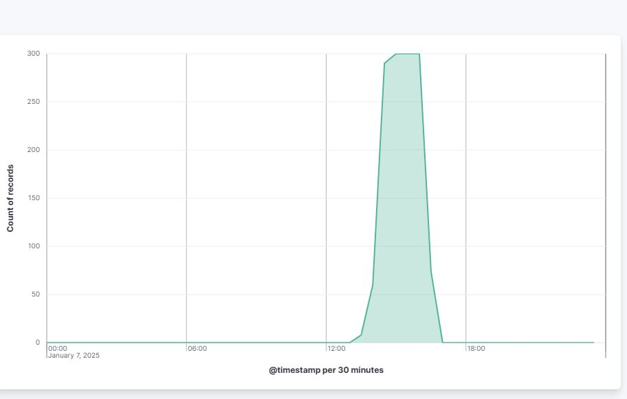

# Elastic-SIEM-Lab
<h1>JBloom - Elastic SIEM Lab</h1>

<h2>Description</h2>
In this lab we will be setting up an elastic SIEM enviornment using Kali linux.
<br />


<h2>Project Walkthrough:</h2>


<b>Step 1: Create a Kali Linux VM In Vbox </b>

 <b>To begin I need to have a kali linux virtual machine. By heading over to this [website](https://www.kali.org/get-kali/#kali-virtual-machines) I downloaded a prebuilt kali machine. From there its as simple as extracting the file and opening it in virtualbox. Since I had the option to increase the memory and computing power of this machine I decided to juice it up a bit. For more specific steps on setting up virtual box machines you can check out a previous lab I created [here](https://github.com/Jbloom76/Virtual-Machine-Setup) <b>
 
 
 
 <h2>Step 2: Set Up An Elastic Free Trial</h2>
 
 <b>To start this step we can head over to [Elastic](https://cloud.elastic.co/registration) to set things up.</b>

- <b> Create an account
- <b> Click on "create deployment"
- <b> Select "search" for the deplyment type
- <b> Click on "create deployment" and wait for the configuration to complete
- <b> Click on continue to complete this step

 

  <h2>Step 3: Confirgure The Agent To Collect Data</h2>

- <b>Open the new deployment and in the top right corner type elastic defend into the search bar then click on "add integration"


  
- <b>Make sure that linux tar is selected and copy the command to your clipboard


  
- <b>Paste the command into the kali linux terminal



- <b>Once this is installed on your kali machine you should see a message saying the installation was successful



- <b>You can test to make sure you installed it correctly by running this command: sudo systemctl status elastic-agent.service



   

<h2>Step 4: Generating Security Events Using NMAP</h2>

- <b>We need to run an nmap scan on our virtual machine. Nmap comes with kali by default so we won't need to install it. We do however need to know the ip address of the kali machine. We can find out this information using the ip a command. Running this command we find our ip address is 10.0.2.15/24



- <b>Now that we know our ip address we can now run the command sudo nmap 10.0.2.15/24


<h2>Step 5: Create a visualization of the data</h2>

- <b>Navigate to the dashboards tab
- <b>Select "create visualization"
- <b>Select area for the graph type
- <b>On the horizontal axis select timestamp
- <b>On the Vertical axis select count
- <b>After generating the graph you should get something similar to this:



<h2>Final Thoughts:</h2>

<b>There were several extra things I wanted to include here but was not able to. The lab I was following used an older version of elastic and they have changed what comes as default on the free trial. I would have loved to have included the following:<b>

- <b>I would set up an alert based on a custom query for nmap scans
- <b>I would filter the data so that we could examine the nmap logs using querys like event.action: “nmap_scan” or process.args: “sudo”

<b>These can still be done with the free trial but would require using additional integrations that I was unaware that I would need and unecessarily complicate this lab so to keep things simple we will leave it here.

<h2>Conclusion</h2>

<b>That will wrap things up for now! hope you enjoyed this project!</b>

</p>

<!--
 ```diff
- text in red
+ text in green
! text in orange
# text in gray
@@ text in purple (and bold)@@
```
--!>
